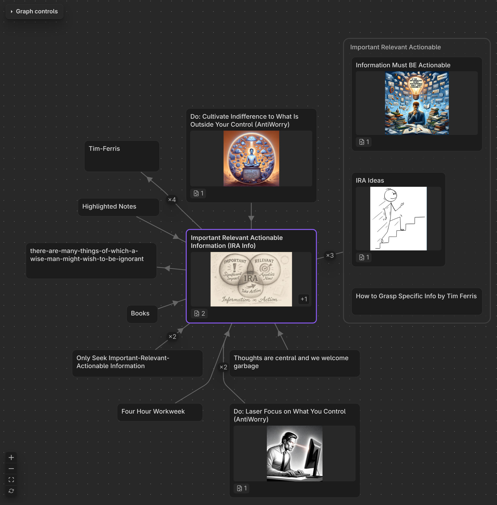

# Vicinity Graph

A richer replacement for Obsidian's native local graph. Instead of identical
dots, Vicinity Graph shows the neighbourhood of your active note as informative,
folder-grouped nodes — each one telling you what the note is before you open it.

## Why you'd want it

The native local graph makes every note look the same and shows no structure
between them. Vicinity Graph fixes both:

- **Nodes that actually tell you something.** Each node carries its title, a
  first-image thumbnail, an icon strip for its attachments, its folder, and a
  size that reflects relevance.
- **Folders you can see.** Notes that share a folder render inside a labelled
  group box, so folder membership is part of the picture.
- **Connectors that stay out of the way.** Links are drawn as calm, right-angled
  connectors that route *around* your notes instead of cutting across them, so a
  busy graph stays readable — and every connector is clickable (see below).
- **Depth you control per relationship.** Outgoing links, embedded notes and
  incoming links each get their own reach, adjustable right in the view.
- **Pinning — globally or per note.** Hold one or more neighbourhoods on screen
  while you browse elsewhere.

The view opens in the right sidebar by default (matching native local-graph
muscle memory) and can be dragged into the main area.

## Install

Vicinity Graph is in the **Obsidian community plugin store**. Requires Obsidian
**1.12.4** or newer.

### Community plugins (recommended)

1. **Settings → Community plugins**, and turn on community plugins.
2. **Browse**, search for **Vicinity Graph**, **Install**, then **Enable**.
3. Run the **Vicinity Graph: Open in right sidebar** command.

## Where the graph opens

Two commands, both bindable to a hotkey:

| Command | Places the graph |
|---|---|
| **Vicinity Graph: Open in right sidebar** | docked in the right sidebar |
| **Vicinity Graph: Open below active note** | in a main-area pane below the current tab |

There is only ever **one** graph view: running either command moves the graph
there; running the command for where it already is just focuses it.

## Interacting with the graph

- **Click a node** — it becomes the graph's **central** note, and its markdown
  opens in the current tab. **Ctrl/Cmd-click** opens the note in a new tab.
- **Click a connector** — opens a preview of **that relationship**: every place
  the source note links the target, each expandable to its surrounding context
  with a **GO** button that jumps the editor to that exact line.
- **Drag a node's right/bottom edge or corner** to resize it; the handles appear
  on hover. The new size is remembered for that note in every graph.
- **Right-click a node** — pin / unpin, plus *Reset size* on a note you resized.
- Folder-group boxes are containers, not notes — clicking one does nothing.

## Pinning

Pinning holds a note's neighbourhood on screen as an extra central node. There
are **two kinds**, each with its own control (revealed on hover, top-right, and
in the right-click menu):

- **Global pin** — pins the note into **every** graph, whatever your active note
  is. Use it to keep a hub or a note you're working from always in view.
- **Per-note (local) pin** — pins the note **only while a particular note is
  active** (*Pin for this note*). Switch away and it disappears; switch back and
  it returns. The target shows even if the active note has no link to it. A note
  can carry both kinds at once.

Both kinds survive restarts and are keyed to a stable note id, so renaming or
moving a pinned note keeps it pinned. Pinned centrals traverse with their own
depth budget (the *Pinned …* dials), separate from the active note's.

> Just after an Obsidian restart, a pinned central can briefly render as a plain
> node until the background cleanup sweep runs (~15s). The pin is not lost — only
> its accent lags.

## Settings

**Every setting is global** — one value used by every note and every open graph.
The only things remembered *per note* are the facts you set on it directly:
which notes are **pinned** and which you've **resized**.

Two surfaces edit the same values and stay in sync: the **settings tab**
(**Settings → Vicinity Graph**) and the in-view **Graph controls** panel.
Controls answer immediately — move a slider, toggle or field and the graph
redraws behind it.

The settings, grouped the same way on both surfaces:

- **Depth** — how far traversal reaches from each central note, with a separate
  budget for outgoing links, embedded notes and incoming links — and a second
  set of budgets for pinned notes.
- **Edges** — *Show cross links* also draws links between two on-screen notes
  that traversal never walked (which notes are shown never changes, only the
  lines between them).
- **Node sizing** — each node fits what it shows between a minimum and maximum
  height, with an optional extra floor for image nodes. A size you set by
  dragging always wins.
- **Node contents** — a *Preview* pill choosing what a node shows: **Auto**
  (outline for your roots, first image for neighbours), **Title only**,
  **Outline** or **Image**, plus an *Outline depth* for how many heading levels
  an outline shows. Clicking an outline entry opens the note at that heading.
- **Force layout** — sliders named like Obsidian's native graph (center, repel,
  link force, link distance) plus spacing and edge-clearance controls, each with
  a *Restore defaults* button.
- **Node exclusion** — keep whole classes of notes (index/MOC hubs, templates, a
  `rel/` folder) out of every graph via a regex pattern list. Your central and
  pinned notes always stay.
- **Performance** — a node cap (default **100**, the readable ceiling); beyond it
  the graph truncates and shows a hidden-node count.

Typed fields (sizing numbers, node cap, patterns) apply once you pause typing or
leave the field, not per keystroke. Every section has its own *Restore defaults*
row, and **Restore all Vicinity Graph settings** at the bottom resets everything
— **your pinned notes are never touched by any of them**.

## Scope & limits

- **Local graph only** — no global graph, and no unresolved (ghost) links.
- **Layout is computed** — node positions aren't manually draggable-to-persist
  (dragging resizes; it doesn't move).
- **Outline entries jump to the first heading with that text**, so duplicate
  headings are ambiguous. `*.excalidraw.md` and canvas files show no outline.
- Heading labels strip common inline markdown but aren't a full renderer; the
  raw heading text is always what opens the note.

## Third-party notice

The right-angled connectors are routed by
[libavoid-js](https://github.com/Aksem/libavoid-js), a WebAssembly build of the
**libavoid** connector-routing library, licensed **LGPL-2.1-or-later**. It runs
entirely offline (no network, no disk) and only ever receives on-screen node
rectangles — never your note contents, paths, or metadata.

## Development

Building, testing, and cutting releases are covered in
[`docs-internal/development.md`](./docs-internal/development.md).

## License

Vicinity Graph is **source-available** under the **Kondratyev Source Available
License, Version 2.3 (KSAL-2.3)** — not an OSI open-source license. See
[`LICENSE.md`](./LICENSE.md), which is the authoritative and controlling text.
