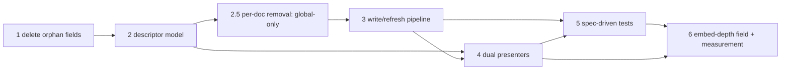

# Settings — overarching context

Single source of over-arching context for all settings work. Every ticket tagged
`settings-cleanup` links here; read this before picking any of them up.

## Grouping convention (no epics)

There are **no epic tickets** for this work. Grouping is done with the tag
`settings-cleanup`; ordering is encoded in each ticket's `deps` frontmatter.

```bash
ticket ready -T settings-cleanup     # what is unblocked right now
ticket blocked -T settings-cleanup   # what is waiting, and on what
ticket dep tree nid_fay1hu5sxcoygizopkkg0f0d7_e   # full chain (terminal ticket)
```

## Why this exists (the problem)

Adding ONE settings field costs **~180 lines across ~15 files** and touches
**~8 hand-maintained parallel lists** that fail *silently* when one is missed
(measured in research ticket `nid_8p0nn2g34d97finokwlz3u1dt_e`, closed). The
genuinely silent holes are:

1. ~~`src/persistence/persistedShapes.ts` — the view-field parse branch table
   (`parseViewOverride`, renamed `parseViewFields` by 2.5)~~
   **CLOSED by ticket 2** — the `ParsedViewFields` mapped type makes an unparsed
   field a compile error (TS2741) naming it.
2. ~~the reset-scope table (`src/view/settingsResetPlan.ts`)~~
   **CLOSED by ticket 2** — `src/view/settingsSectionFields.ts` declares which
   fields each section owns, the reset plans derive from it, and a field in no
   section is a compile error naming it.
3. settings-tab vs in-graph-panel UI parity (no guard at all) — **still open**,
   ticket 4 (dual presenters) + ticket 5 (parity test).

(There is no resolver hole either: since 2.5 **no site enumerates `ViewSettings`
fields** — `globalView` is read straight through, and the one place that rebuilds
the type field-by-field is the parse layer, guarded by `ParsedViewFields`.)

### Three more silent holes, found and closed while doing ticket 2

4. `src/engine/SettingsSpec.ts` — the spec interfaces were independent of the
   settings types, so a field could exist with no default and no bounds. The
   ROOT of the family: everything downstream derives from the spec. Now guarded
   in **both** directions (missing entry, and orphan entry for a deleted field).
5. `src/engine/constants.ts` — `SizingRangeField` was a hand-typed union, so a
   new bounded sizing field silently got no range and no clamp. Now
   `Exclude<keyof SizingSpec, "metrics">`.
6. `src/view/sizingMetrics.ts` — `SIZING_METRICS` is an order-bearing array, so
   a missing metric vanished from both sizing surfaces without a compile error.
   Now `as const satisfies` + a completeness guard. (The unit test stays: it
   catches a metric listed TWICE, which a type guard cannot see.)

Plus one live structural defect: the in-graph panel's force-layout "Restore
defaults" built its own defaults object instead of using the shared reset plan —
a fourth opinion on what a default is. Now routed through `planSettingsReset`,
and `src/view/engineDefaultsSingleSource.test.ts` keeps it that way.

### What ticket 3 (write/refresh pipeline) added to the family

The write path is now ONE object, `src/view/settingsWritePipeline.ts` (one instance
per plugin, in `main.ts`), shared by the settings tab and every controls panel. It
owns serialisation, the merge base, the persist switch and the fan-out. Two
consequences for anyone adding a field:

- **A control emits a `SettingsInteraction` naming ONE field.** The whole-slice arms
  (`global-sizing`, `global-force-layout`, `global-node-exclusion`) are GONE —
  they were the sibling-clobbering vector, because the caller supplied the merge
  base. `planSettingsWrite` is the only merger and it merges over a read the
  pipeline takes inside its own serialised slot. So a new field costs one more
  interaction arm plus one more `switch` case (both compile-forced), NOT a new
  merge site.
- **Nothing else may serialise or refresh.** `shared/SerialPromiseChain.ts` is the
  one ordering primitive (used by the pipeline and by `PluginDataStore`'s disk
  writes); the three hand-rolled chains and `SettingsWriteQueue` are gone.
  `settingsResetSequence.ts` owns the restore-defaults ORDER and is the vitest
  harness for it, since the tab itself has none.

### Cost of adding one field AFTER ticket 2

The compiler now NAMES every site you miss except the last:

1. `src/engine/types.ts` — the field on `ViewSettings` / `DepthSettings` *(forces 2–4)*
2. `src/engine/SettingsSpec.ts` — spec entry + `SETTINGS_SPEC` value *(guarded)*
3. `src/persistence/persistedShapes.ts` — one parse expression *(guarded)*
4. `src/view/settingsSectionFields.ts` — one key in one section *(guarded)*
5. `src/view/settingsWritePlan.ts` — one interaction arm + one `switch` case *(guarded: the `switch` is exhaustive)*
6. UI copy + row rendering in the tab and the panel *(ticket 4's job to guard)*

This is "compile-forced N declarations", NOT the ticket's literal "ONE
declaration". Deriving the `ViewSettings` TYPE from a runtime descriptor array
was declined: it weakens the compile-time completeness of `ViewSettings` itself
(forbidden by the owner's standing constraints) and costs the per-field doc
comments. The failure mode this chain exists to kill is *silent* drift —
compile-forced is not silent.

**Ratified by the owner on 2026-07-29**: "compile-forced N declarations" replaces
the descriptor ticket's literal "ONE declaration" as the standing acceptance bar
for this chain. The original clause and the standing completeness constraint were
in direct tension; the owner resolved it in favour of the constraint.

**Restated on 2026-07-29 with 2.5** (owner accepted the restatement): the bar used
to name `ViewSettingsResolver.resolve()`'s return-type completeness. That class is
deleted, and the guarantee is not weakened but relocated — nothing enumerates
`ViewSettings` fields at runtime any more, and completeness is compile-forced by
the descriptor model — the `ParsedViewFields` mapped type
(`src/persistence/persistedShapes.ts`) plus the `Exclude<keyof ViewSettings, …>`
completeness guards in `src/engine/SettingsSpec.ts` and
`src/view/settingsSectionFields.ts` — backed by the all-fields-non-default
round-trip pair in `persistedShapes.test.ts`. **Read the bar as: do not weaken
THOSE.** Tickets 4/5/6 inherit this reworded bar, not either
earlier wording.

This drift has already produced real symptom tickets: stale baseline tests
(twice), reset racing a queued write, sibling-field clobbering from stale
snapshots, tab rows with no panel counterpart, and a11y naming divergence.

The owner approved the larger rewrite on 2026-07-29.

## The chain — order and why

| # | Ticket | What | Why this position |
|---|--------|------|-------------------|
| 1 | `nid_niz5dz6uqeyv237ckm15ittqa_e` | Delete orphan fields `groupByFolder` + `edgeVisibility` (owner decided: DELETE) | Shrink the field surface *before* building descriptors — don't pay descriptor cost for dead fields. |
| 2 | `nid_wimjq4ewgbg21n4zx9d4qq3a0_e` | **Descriptor model**: one declarative field descriptor drives spec, type, defaults, parse, write plan, reset scope | The foundation everything else derives from. Primary invariant: an absent field parses as "inherit the spec default". |
| 2.5 | `nid_ez38gf1mrdgh5kxedzrdicwzl_e` | **Per-doc removal**: delete all per-doc saved state (doc-data/ files, per-doc depth/view overrides, per-central `centralDepths`); settings become GLOBAL-only; pins stay GLOBAL | Owner decision 2026-07-29. Before the pipeline/presenters/tests so they are built against the global-only model instead of carrying per-doc arms that would then be deleted. Subsumes the sibling-views-stale legacy ticket and obsoletes the doc-data dir-name constant ticket. |
| 3 | `nid_m5hxe4eo9jgt7cfic7s2o3uvi_e` | **Write/refresh pipeline**: one serial chain, fresh-read writes, reset drains queue, one fan-out rule (global-only after 2.5) | Fixes the remaining symptom bugs that share one cause. Before presenters, so presenters wire to the final write path once. |
| 4 | `nid_armoson86j0ii8c33r1odo1rc_e` | **Dual presenters**: tab + in-graph panel render one descriptor model | Needs descriptors (rows as data) and the pipeline (writes). Unblocks 4 UX satellite tickets. |
| 5 | `nid_x6hgehsu5il1d1shuraz3ufqy_e` | **Spec-driven tests**: iterate the descriptor list instead of hand-enumerated literals; parity test tab-vs-panel | Needs the final shape of 2–4 to pin against. |
| 6 | `nid_fay1hu5sxcoygizopkkg0f0d7_e` | **Embedded-outgoing-link depth field** — first new field added under the new model, WITH cost measurement | The proof step (absorbed former E5): record files/lines cost vs the ~15-file baseline. Last, so the measurement is honest. |



## Satellite tickets (blocked on the chain)

- Behind **per-doc removal (2.5)**: `nid_7fq9y51mbucmduzf9z31hmwmq_e` (doc-data
  dir constant — obsolete once the dir is deleted; close with 2.5). Legacy-file
  ticket subsumed by (2.5), close when it lands:
  `docs-internal/tickets/ticket-per-doc-write-leaves-sibling-views-stale.md`
  (per-doc writes cease to exist). Re-verify after 2.5:
  `docs-internal/tickets/ticket-pinned-central-status-lags-after-restart.md`
  (pins stay global, so it likely survives).
- Behind **pipeline (3)**: `nid_8b97fdqznqsncc5kgya1p871w_e` (reset display()
  races queued write), `nid_4zffe7mj5p1eabi9m6wfh06k0_e` (three hand-rolled
  serial chains → one helper). Legacy-file ticket subsumed by (3), close when
  it lands: `docs-internal/tickets/ticket-controls-optimistic-input-latency.md`.
- Behind **presenters (4)**: `nid_1rslube8at5xj60ji4jeve0b0_e` (Depth group),
  `nid_qp56jugz8en8wkgjirwcb269p_e` (exclusion row disabled-not-hidden),
  `nid_klkdpmx6axf90y4xj8khwrlf2_e` (panel outline-depth control),
  `nid_que9qloigra7ku2boh83qizz0_e` (panel a11y nits),
  `nid_hatwq2jlkhno5t6awcz0q6t9q_e` (minPx/maxPx validation UX — fix once in
  the unified renderer, not twice),
  `nid_puf4a4q6fgn5lpehh5dowfm1r_e` ("Show cross links" — new full-cascade
  boolean, default OFF; decided wanted 2026-07-29, both presenters).
- Behind **tests (5)**: `nid_ek3wrqoh1rsftk6ulg836mghf_e` (e2e types into a
  settings input).
- Behind **descriptor model (2)** only: `nid_zvoay26y4y9h1e2p2b1y9glfk_e`
  (new intra-group spacing field — add it under the new model, not the old).

Independent (no reason to block): `nid_aau4r0sj8oudhi711qr9j5x1l_e` (nodeCap
upper bound), `nid_uwnew3dok0gn8ijar54hiozst_e` (pre-release slider tuning).

## Standing owner decisions (2026-07-29)

- **Global-only settings for now (2.5)** — all per-doc saved state (per-doc
  depth/view overrides, per-viewing-doc `centralDepths`, the whole `doc-data/`
  dir) is removed. Pins stay, and stay **global**; one global depth setting
  drives MAIN and every pinned central (no per-central dials). Relevant specs
  (`docs-internal/plan/high-level-plan.md`, `README.md` Depth/Pinning,
  `docs-internal/architecture-map.md`) must be updated by the tickets touching
  this — see `nid_ez38gf1mrdgh5kxedzrdicwzl_e`.
- **Clean breaks on stored data while unpublished** — no migrations, no
  dual-key shims; announce resets in the release note (see `CLAUDE.md`).
- **An absent field means "inherit the spec default"** — still the primary design
  constraint a naive descriptor rewrite would break, now scoped to **descriptor /
  parse semantics only**: since 2.5 there is no override *layer* (and no
  `ViewSettingsOverride` type). What the rule governs today is the read path — a
  field missing from `data.json` parses as `undefined` and is merged over
  `PersistedShapes.defaultPluginData()`, so it inherits the spec default rather
  than a zero value. A descriptor rewrite must keep "absent ≠ present-but-default"
  distinguishable at parse time.
- **Orphan fields**: delete `groupByFolder` + `edgeVisibility`, hardcode
  surviving behavior (grouping ON, edges `walked-from-center`).
- **Exclusion patterns row**: always render, disabled when inapplicable —
  becomes a declarative `disabledWhen` flag.
- **Depth naming** (full rename, no migration): `linkDepthOut` / `embedDepthOut`
  (new) / `linkDepthIn`; UI: "Links out" / "Embeds out" / "Links in".
  **DEFERRED to ticket 6** (owner decision D2, 2026-07-29): ticket 2 keeps
  `outgoingDepth` / `incomingDepth` and their current UI copy. The rename only
  pays off once `embedDepthOut` disambiguates the names; doing it earlier churns
  user-facing copy plus ~6 e2e literals for no structural benefit.
- **Tests**: structural spec-iterating tests, but KEEP a small number of literal
  assertions for product-meaningful defaults (e.g. nodeCap 100).
- **Obsidian constraint**: the Setting API cannot mount inside React, so there
  will always be two renderer *implementations* — parity is guarded by a test
  over the descriptor list, not by a single renderer.
